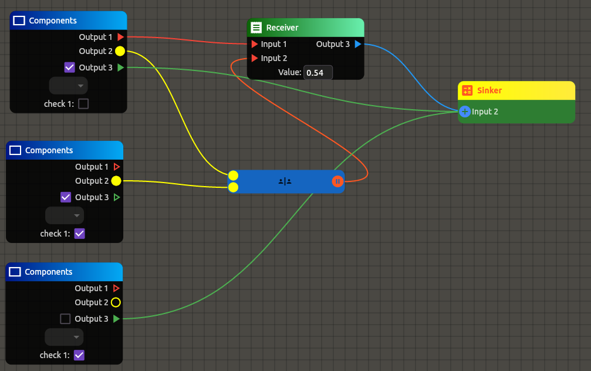

<!--
This README describes the package. If you publish this package to pub.dev,
this README's contents appear on the landing page for your package.

For information about how to write a good package README, see the guide for
[writing package pages](https://dart.dev/guides/libraries/writing-package-pages).

For general information about developing packages, see the Dart guide for
[creating packages](https://dart.dev/guides/libraries/create-library-packages)
and the Flutter guide for
[developing packages and plugins](https://flutter.dev/developing-packages).
-->

<h1 align="center"><b>Node Editor</b></h1>

<p align="center">A highly customizable node editor for Flutter</p>


<p align="center">
        
</p>

## Features

* **Flutter Widgets for Nodes & Ports:** Customize nodes and ports with any Flutter widget, offering unparalleled UI flexibility.
* **Interactive Node Elements:** Embed interactive widgets like text fields and checkboxes directly in nodes for dynamic user input.
* **Customizable Connections & Backgrounds:** Tailor connections and backgrounds with extensive styling options for visual coherence.
* **Dynamic Port Logic:** Advanced logic for port connections, including customizable verification and unlimited connection capacities.
* **Extensible Design:** Easily add new node and port types with your custom widgets, ensuring scalability.
* **Cross-Platform Compatibility:** Build once, deploy everywhere with Flutter’s cross-platform capabilities.

## Getting started

TODO: List prerequisites and provide or point to information on how to
start using the package.

## Usage

TODO: Include short and useful examples for package users. Add longer examples
to `/example` folder.

```dart
const like = 'sample';
```

## Additional information

TODO: Tell users more about the package: where to find more information, how to
contribute to the package, how to file issues, what response they can expect
from the package authors, and more.
